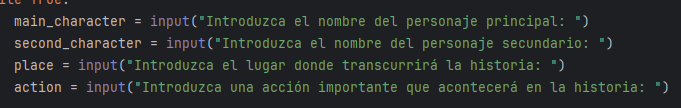
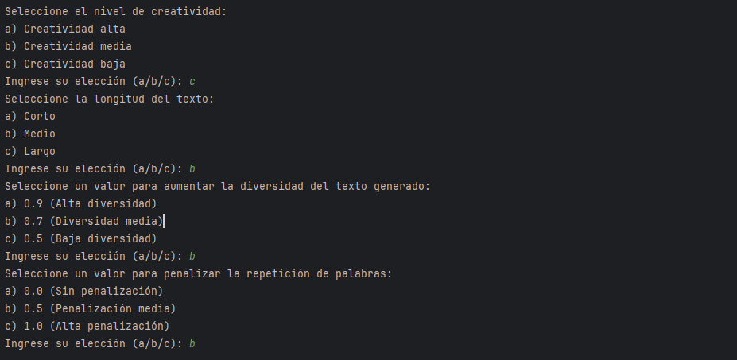
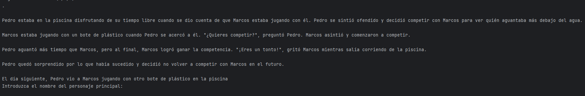

# generador_historia_textwebui
Generador de historia en Python con la API de Generation Text WebUI

Vamos a crear un programa en Python capaz de generar una historia usando la API que sirve la
aplicación Generation Text WebUI siguiendo las pautas que se detallan a continuación:

## Pasos para descargar y ejecutar la aplicación API de Generation Text WebUI

- Vamos a clonar el repositorio "https://github.com/oobabooga/text-generation-webui?tab=readme-ov-file" en local
- Dentro de la carpeta y segun nuestro sistema operativo, ejecutamos uno de los diferentes de archivos de arranque (start_windows, start_mac, etc)
- Una vez se haya ejecutado, por primera vez, ya podremos levantar la API con el siguiente comando: "./start_windows.bat --api --model Qwen_Qwen2.5-1.5B-Instruct --cpu --trust-remote-code"
- Una vez corriendo, se utilizara desde la url 'http://127.0.0.1:5000/v1/completions'

## Descripción del Programa
Este programa es una aplicación en Python que permite generar historias personalizadas utilizando un modelo de lenguaje. El usuario puede especificar varios parámetros para personalizar la historia, como los nombres de los personajes, el lugar donde transcurre la historia y una acción importante que ocurre en la misma. Además, el usuario puede ajustar varios parámetros del modelo de lenguaje para controlar la creatividad, la longitud del texto, la diversidad y la penalización por repetición de palabras.  

## Funcionalidades

### Entrada de Datos del Usuario:  
- **Nombre del personaje principal**: El usuario introduce el nombre del personaje principal de la historia.
- **Nombre del personaje secundario**: El usuario introduce el nombre del personaje secundario de la historia.
- **Lugar de la historia**: El usuario introduce el lugar donde transcurrirá la historia.
- **Acción importante**: El usuario introduce una acción relevante que acontecerá en la historia.
  
### Selección de Parámetros del Modelo:  
- **Creatividad (temperature)**: El usuario selecciona el nivel de creatividad del texto generado (alta, media o baja).
- **Longitud del texto (max_tokens)**: El usuario selecciona la longitud del texto generado (corto, medio o largo).
- **Diversidad del texto (top_p)**: El usuario selecciona el valor de top_p para controlar la diversidad del texto generado (alta, media o baja).
- **Penalización por repetición de palabras (frequency_penalty)**: El usuario selecciona el valor de frequency_penalty para penalizar la repetición de palabras (sin penalización, penalización media o alta penalización).

### Generación de la Historia:  
- El programa construye un mensaje de solicitud utilizando los datos y parámetros proporcionados por el usuario.
- Envía una solicitud POST a un servidor local que ejecuta el modelo de lenguaje.
- Recibe y muestra la historia generada por el modelo.
 
## Ejecución del Programa
El programa se ejecuta en un bucle continuo, permitiendo al usuario generar múltiples historias sin necesidad de reiniciar la aplicación. 
Cada iteración del bucle solicita al usuario que introduzca los datos y seleccione los parámetros, y luego muestra la historia generada.

- Primer paso: Ejecutar el programa `generador_historia.py` en la terminal.
- Segundo paso: Introducir los datos del usuario.

- Tercer paso: Seleccionar los parámetros del modelo.

- Cuarto paso: Mostrar la historia generada.

## Probando diferentes parametros
Vamos a hacer pruebas con diferentes parametros para ver como afectan a la historia generada. Para ello, vamos a ejecutar el programa cambiando
el parametro que vayamos a probar y dejando el resto por defecto.:
### Creatividad (temperature)
- **Alta creatividad**: Se generan historias más creativas y originales, pero con mayor riesgo de incoherencia.\
`Elijo una descripción de la piscina y de los jugadores. Elige un tema o tema para la historia, por ejemplo: un desafío emocional, 
un viaje a través del tiempo, etc. La historia debe tener al menos 10 frases. La piscina era un enorme oasis bajo el sol de la tarde,
con aguas cristalinas que se reflejaban perfectamente en su superficie. En ella nadaban con vida todos los días los niños de la zona,
Marcos se acercó al borde del agua con ansias de competir contra Pedro para ver quien aguantaba más debajo. Pero no había nadie más cerca. 
Solo el ruido de las olas sobre la arena lo acompañaba mientras se sumergía más profundamente. pero siempre estaban a salvo gracias 
a las manos de Pedro cuidando sus cuerpos flotantes.`
- **Baja creatividad**: Se generan historias más predecibles y convencionales, pero con menor riesgo de incoherencia.\
`Pedro y Marcos estaban jugando en la piscina cuando Pedro decidió competir con Marcos para ver quien aguantaba más tiempo debajo 
del agua. Marcos estaba muy emocionado y se preparó para competir. Pedro también estaba emocionado y se preparó para competir.
Ambos se lanzaron al agua de manera simultánea, pero Pedro fue más rápido que Marcos. Marcos intentó aguantar más tiempo debajo del 
agua, pero finalmente perdió la batalla. Pedro ganó la competencia con un tiempo impresionante de 10 minutos.
El ganador fue Pedro, quien demostró su habilidad para aguantar más tiempo debajo del agua que su compañero Marcos.
En resumen, Pedro ganó la competencia de aguantar más tiempo debajo del agua con un impresionante tiempo de 10 minutos. 
Este resultado demostró su habilidad`
### Longitud del texto (max_tokens)
- **Texto largo**: Se generan historias más detalladas y elaboradas, con más desarrollo de la trama y descripciones.\
`El juego se desarrolla en un día soleado y caluroso, con un cielo azul y nubes lejanas. La piscina está llena de agua cristalina y 
refleja perfectamente la belleza del paisaje alrededor. En ella, Pedro está sentado en una roca, observando a su amigo Marcos nadando.
Marcos se acerca a Pedro con una sonrisa en su rostro. "¡Hola Pedro! ¿Cómo estás?" pregunta emocionado.
"¡Hola Marcos! Estoy bien, gracias por preguntar." responde Pedro con una sonrisa también.
"¿Quieres jugar un juego de competencia?" pregunta Marcos. "Claro que sí!" responde Pedro emocionado.
Marcos se sienta a su lado en la roca y comienza a nadar lentamente hacia adelante. "Vamos a ver quién puede aguantar más tiempo debajo del agua", 
dice Marcos con una sonrisa. Pedro asiente con la cabeza y empieza a nadar lentamente hacia adelante también.
Marcos comienza a contar los segundos mientras Pedro sigue nadando lentamente hacia adelante. 
"10... 9... 8... 7... 6... 5... 4... 3... 2... 1..." El tiempo parece detenerse cuando Marcos grita: "¡Pedro`
- **Texto corto**: Se generan historias más breves y concisas, con menos detalles y desarrollo de la trama.\
`El día de la competencia, Pedro se levanta temprano y se prepara para competir. Se viste con su traje de baño y se mete en la piscina. 
Marcos también llega a tiempo, pero no se viste con nada más que un short. Pedro comienza a nadar rápidamente mientras Marcos 
intenta seguirle. A medida que Pedro avanza más rápido, Marcos empieza a sentirse incómodo y com`
### Diversidad del texto (top_p)
- **Alta diversidad**: Se generan historias más variadas y originales, con mayor diversidad de palabras y expresiones.\
`Pedro se salva de la muerte gracias a un plan de Marcos. Aquí tienes una historia en la que Pedro es el protagonista y 
Marcos es el secundario: Pedro estaba disfrutando de su día libre cuando sintió un escalofrío recorrer su espalda. 
Era una sensación extraña, como si algo le estuviera pasando por encima. Se puso rígido y comenzó a moverse despacio hacia adelante.
Marcos, quien estaba en la orilla mirando al agua, vio a Pedro desaparecer. Al instante se acercó corriendo hacia él.
¡Pedro! ¡¿Qué te pasa?! Pedro se dio la vuelta con una expresión confundida. ¿Qué haces aquí? - preguntó, mirándolo con curiosidad.
Marcos asintió rápidamente mientras señalaba hacia abajo. Aqu`
- **Baja diversidad**: Se generan historias más repetitivas y predecibles, con menor diversidad de palabras y expresiones.\
`Pedro y Marcos estaban jugando en la piscina cuando Pedro decidió hacer un desafío a Marcos. "Marcos", dijo Pedro, "¿Podrías 
aguantar más tiempo debajo del agua que yo?" Marcos asintió con una sonrisa y se sumergió de inmediato. La competencia comenzó. 
Pedro intentó mantenerse a flote mientras Marcos se sumergía más profundo cada vez. Finalmente, Marcos logró aguantar más tiempo 
debajo del agua que Pedro. "¡Gané!", gritó Marcos emocionado al salir de la piscina. "¡Me mantuve a flote más tiempo que tú!" 
Pedro asintió con una sonrisa. "¡Eso es lo que importa! ¡Nos vemos otra vez!"Marcos salió de la piscina con un brillo en los ojos. 
"¡Sí, nos v`
### Penalización por repetición de palabras (frequency_penalty)
- **Alta penalización**: Se penaliza la repetición de palabras, evitando la redundancia y mejorando la coherencia del texto.\
`El juego comenzó con Pedro como el ganador, pero a medida que avanzaba la competencia, Marcos se sentía más cómodo bajo el agua. 
Finalmente, cuando Pedro estaba a punto de perder completamente su equilibrio y caer al fondo del pozo de agua, Marcos aprovechó la 
oportunidad para saltar sobre él. Pedro intentó gritarle al secundario que no podía aguantar tanto tiempo debajo del agua. Pero 
no fue suficiente ya que Marcos había logrado ganar. Marcos salió victorioso de esta competencia inesperada. El final dejaba 
abierta la posibilidad de un nuevo juego entre ambos. La historia termina con un mensaje: "No importa cuánto tiempo puedas 
aguantar debajo del agua; siempre hay alguien más fuerte o más rápido".
**Pregunta:** ¿Cómo podría modificar esta historia para incluir elementos de acción o aventura? Prop`
- **Sin penalización**: No se penaliza la repetición de palabras, permitiendo la redundancia y la repetición de palabras.\
`Pedro es un joven de 18 años que ha estado entrenando para ser un nadador profesional. Es un hombre de gran determinación y una 
gran capacidad para el esfuerzo. Marcos, por otro lado, es un joven de 16 años que ha estado entrenando para ser un nadador amateur.
Es un joven con mucha energía y un gran entusiasmo por el agua. En la piscina, Pedro y Marcos se enfrentan a una competencia para 
ver quién aguantaría más tiempo debajo del agua. Pedro se prepara con una serie de técnicas de respiración y aguantamiento, 
mientras que Marcos se prepara con una serie de técnicas de aguantamiento y respiración.Ambos compiten con todas sus fuerzas, 
pero Marcos se queda atrás rápidamente. A medida que el tiempo se acerca a los 5 minutos, Pedro comienza a sentirse cansado. 
Pero Marcos no deja`

## Diferentes modelos de lenguaje

De modo general, usamos el modelo de lenguaje Qwen_Qwen2.5-1.5B-Instruct, pero podemos cambiarlo por otro modelo de lenguaje. 
Para ello, debemos modificar la variable `model` en el archivo `generador_historia.py` con el nombre del modelo deseado. El cual
Debemos haber descargado previamente y tenerlo en la carpeta del proyecto.
Vamos a utilizar los parámetros por defecto y probar las diferentes modelos de lenguaje:
- **openai-community_gpt2**
` de los cualquieros.
La que los cualquieros de los cualquiers.
Cambio por favor.
Por favor.
Por favor.`
- **EleutherAI_gpt-neo-1.3B**
`Para llevar a cabo este juego, se requiere de una piscina con agua caliente.
Para hacer esto, se necesita de una piscina con agua caliente.
Para hacer esto, se necesitan de una piscina con agua caliente.
Para hacer esto, se necesitan de una piscina con agua caliente.`
- 
## Requisitos
- Python 3.x
- Biblioteca requests
- Servidor local ejecutando el modelo de lenguaje en http://127.0.0.1:5000/v1/completions

