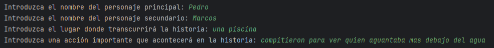

# generador_historia_textwebui
Generador de historia en Python con la API de Generation Text WebUI

Vamos a crear un programa en Python capaz de generar una historia usando la API que sirve la
aplicación Generation Text WebUI siguiendo las pautas que se detallan a continuación:

## Pasos para descargar y ejecutar la aplicación API de Generation Text WebUI

- Vamos a clonar el repositorio "https://github.com/oobabooga/text-generation-webui?tab=readme-ov-file" en local
- Dentro de la carpeta y segun nuestro sistema operativo, ejecutamos uno de los diferentes de archivos de arranque (start_windows, start_mac, etc)
- Una vez se haya ejecutado, por primera vez, ya podremos levantar la API con el siguiente comando: "./start_windows.bat --api --model Qwen_Qwen2.5-1.5B-Instruct --cpu --trust-remote-code"
- Una vez corriendo, se utilizara desde la url 'http://127.0.0.1:5000/v1/completions'

## Descripción del Programa
Este programa es una aplicación en Python que permite generar historias personalizadas utilizando un modelo de lenguaje. El usuario puede especificar varios parámetros para personalizar la historia, como los nombres de los personajes, el lugar donde transcurre la historia y una acción importante que ocurre en la misma. Además, el usuario puede ajustar varios parámetros del modelo de lenguaje para controlar la creatividad, la longitud del texto, la diversidad y la penalización por repetición de palabras.  

## Funcionalidades

### Entrada de Datos del Usuario:  
- **Nombre del personaje principal**: El usuario introduce el nombre del personaje principal de la historia.
- **Nombre del personaje secundario**: El usuario introduce el nombre del personaje secundario de la historia.
- **Lugar de la historia**: El usuario introduce el lugar donde transcurrirá la historia.
- **Acción importante**: El usuario introduce una acción relevante que acontecerá en la historia.
  
### Selección de Parámetros del Modelo:  
- **Creatividad (temperature)**: El usuario selecciona el nivel de creatividad del texto generado (alta, media o baja).
- **Longitud del texto (max_tokens)**: El usuario selecciona la longitud del texto generado (corto, medio o largo).
- **Diversidad del texto (top_p)**: El usuario selecciona el valor de top_p para controlar la diversidad del texto generado (alta, media o baja).
- **Penalización por repetición de palabras (frequency_penalty)**: El usuario selecciona el valor de frequency_penalty para penalizar la repetición de palabras (sin penalización, penalización media o alta penalización).

### Generación de la Historia:  
- El programa construye un mensaje de solicitud utilizando los datos y parámetros proporcionados por el usuario.
- Envía una solicitud POST a un servidor local que ejecuta el modelo de lenguaje.
- Recibe y muestra la historia generada por el modelo.
 
## Ejecución del Programa
El programa se ejecuta en un bucle continuo, permitiendo al usuario generar múltiples historias sin necesidad de reiniciar la aplicación. 
Cada iteración del bucle solicita al usuario que introduzca los datos y seleccione los parámetros, y luego muestra la historia generada.

- Primer paso: Ejecutar el programa `generador_historia.py` en la terminal.
- Segundo paso: Introducir los datos del usuario.

- Tercer paso: Seleccionar los parámetros del modelo.

- Cuarto paso: Mostrar la historia generada.

## Requisitos
- Python 3.x
- Biblioteca requests
- Servidor local ejecutando el modelo de lenguaje en http://127.0.0.1:5000/v1/completions

